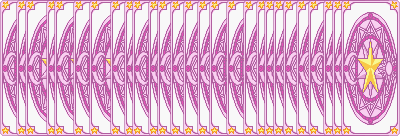
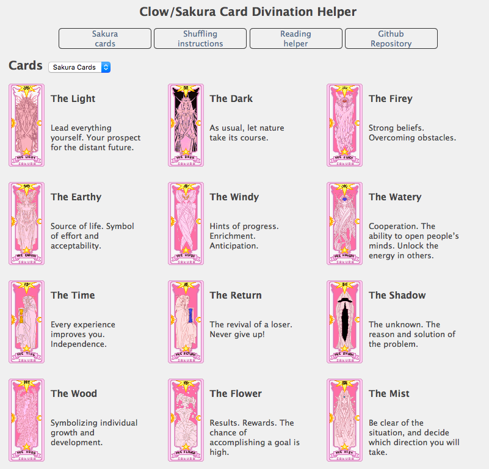
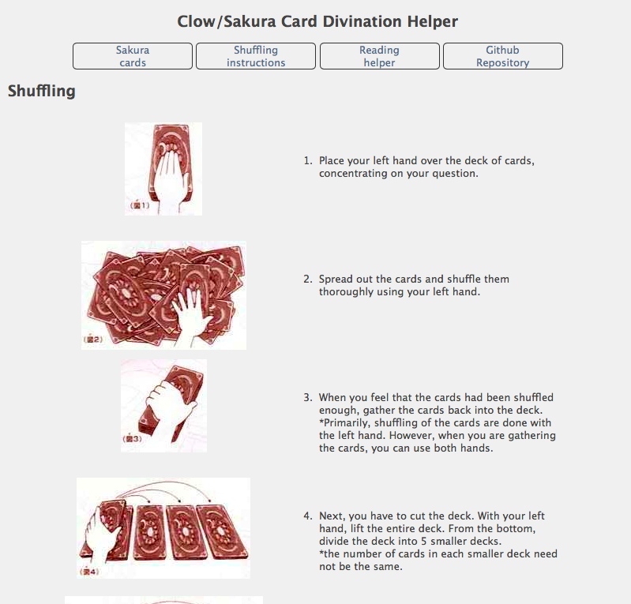
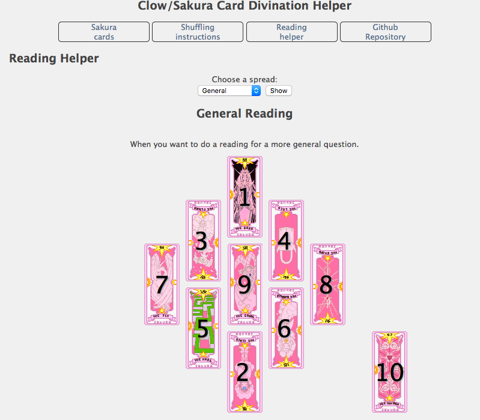
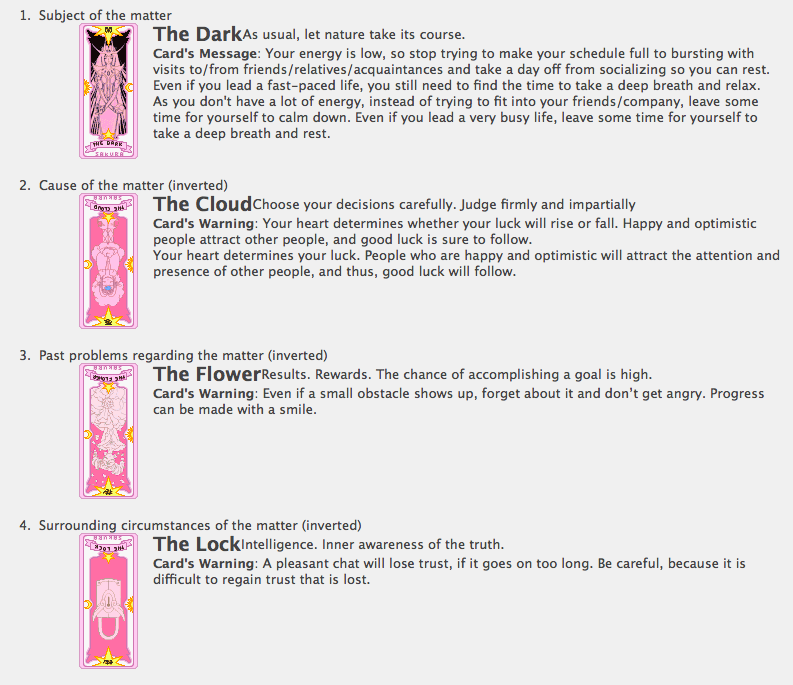

As a fan of the anime &amp; manga <a href="https://en.wikipedia.org/wiki/Cardcaptor_Sakura">CardCaptor Sakura</a> from <a href="https://en.wikipedia.org/wiki/Clamp_(manga_artists)">Clamp</a>, I was estatic to find out that I could buy ACTUAL CLOW CARDS!  Unfortunately, the instructions I received were not in English.  After scouring the internet, I gatherd all the translations that I could and put together this online tool.  Everything is coded in HTML, JS, and PHP.  If you would like to copy these pages for your own website, or even improve on them, please do so!. If you have any questions regarding these pages, or have any requests, feel free to get in touch with me via Twitter @<a href="http://www.twitter.com/nymunariya">Nymunariya</a>.

When you use the reading helping, cards will be randomised by JavaScript, you can have test readings.  The results of those or your actual readings, can be saved and shared with others by copying the URL of the reading.

Clow &amp; Sakura card pictures ripped from "Card Captor Sakura: Sakura Card-hen Sakura Card to Tomodachi (GBA)" by Nightmare.

Copyleft Nymunariya | Cards ripped by Nightmare

Cards overview page:

Shuffling page:

Reading helper:

